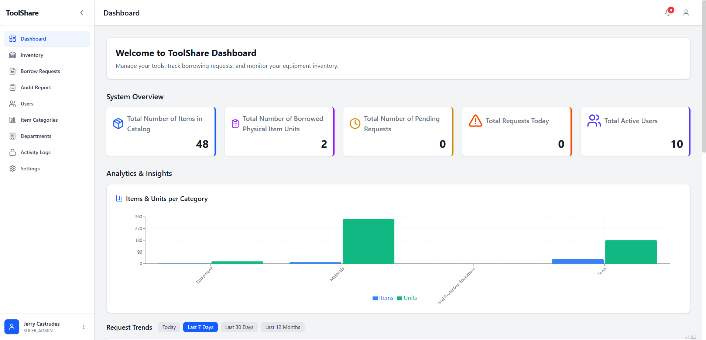
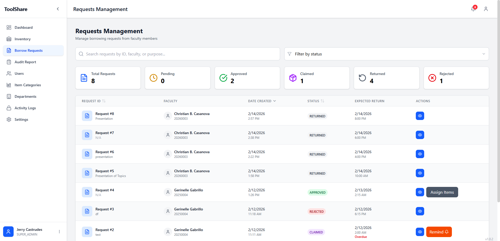
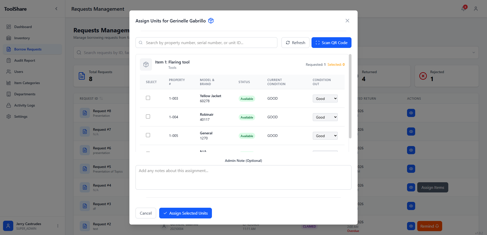
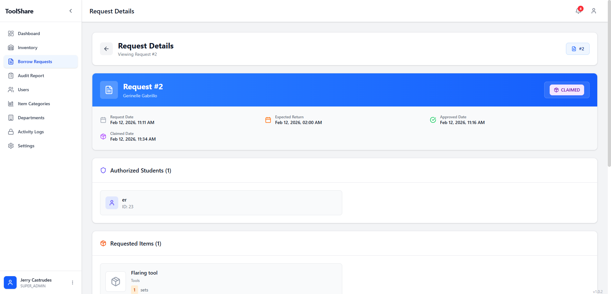
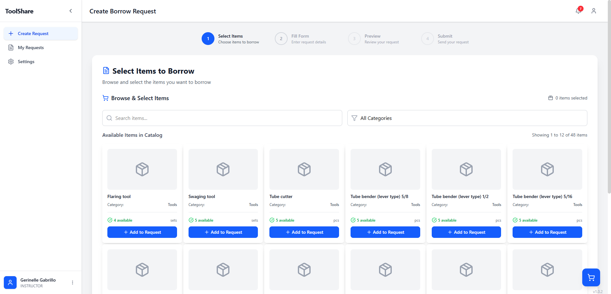
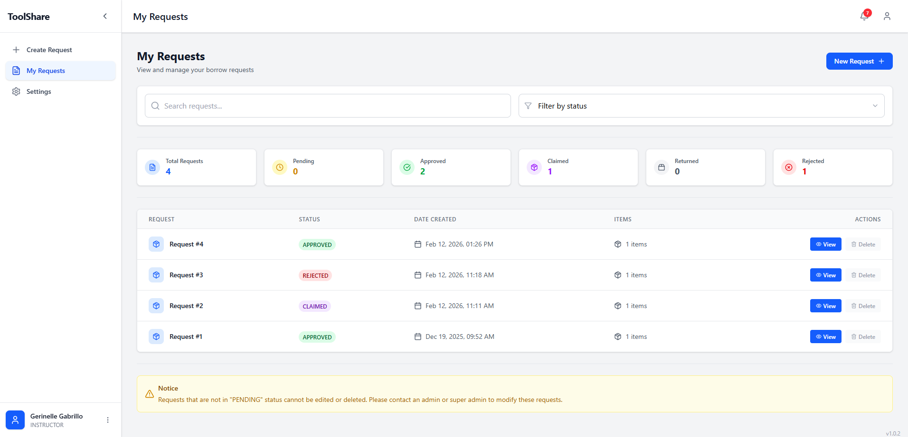

  
  <h1>🧰 Toolshare - Tools & Equipment Borrowing System</h1>

> **Note:** The source code for this repository is private as the system was successfully completed and handed over to the client. This repository serves as an architectural overview and case study of the project.

Toolshare is a comprehensive asset borrowing platform designed to streamline equipment checkout, enforce user accountability, and automate return reminders. It served as my flagship capstone project.

## 🎯 The Challenge & Solution
The client struggled with tracking shared physical assets, resulting in lost equipment and disorganized borrowing records. 

**The Solution:** I engineered a full-stack web application that manages the entire lifecycle of a borrowed item—from the initial request and checkout to automated overdue alerts and final check-in.

## ✨ Key Features
* **Checkout/Check-in Workflow:** A frictionless interface for users to borrow available tools, complete with date tracking and digital logs.
* **User Accountability:** Role-based access control (RBAC) ensuring only authorized users can borrow specific tiers of equipment, with full transaction histories tied to their accounts.
* **Automated Return Alerts:** System-generated notifications designed to warn users of impending due dates and flag overdue items for the admin.
* **Live Availability Dashboard:** Real-time status indicators (Available, Borrowed, Overdue, Maintenance) to prevent double-booking.

## 🛠️ Tech Stack & Architecture
* **Frontend:** React.js
* **Backend:** Laravel (PHP)
* **Database:** MySQL / PostgreSQL *(Update with your specific DB)*
* **Architecture Highlights:** Engineered complex relational database schemas in Laravel to handle user-item pivot tables, transaction histories, and time-based state changes.

## 🚀 Project Status
**Completed & Handed Over.** I managed the full software development lifecycle for this project—from initial client scoping and technical roadmapping to the final production deployment and client handover.

## 📸 System Previews

  
  

  
  

  
  

